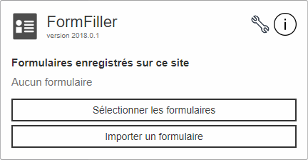
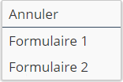

# Form Filler

This project aims to fill forms while being offline.

## Installing

### On Chrome

Visit `chrome://extensions`, activate the Developer mode (at the top of the page),
click the first button, then select the project folder, and that's it.

*Note:* Do not worry if you have warnings while installing, it's because of
compatibility issues between browsers.

### On Firefox

Visit `about:debugging`, click the `Load Temporary Add-on` button, and select the `manifest.json`
file, in the project folder. You're good to go!

*Note:* If you have errors, visit `about:config` and invert the value of the key
`xpinstall.signatures.required`.

## Authors

* [Rémy Raes](mailto:remy.raes@etudiant.univ-lille1.fr)
* [Jules Spicht](mailto:jules.spicht@€tudiant.univ-lille1.fr)

Under the supervision of [Samuel Hym](mailto:samuel.hym@univ-lille1.fr).

## Using

### Download forms

Simply open the extension, and click the "Select forms" button.
You're now in selection mode; from there, you can:

* access to a form fields selection, and choose the inputs you want to download, by left-clicking the concerned form;

* automatically scroll to a form or quit the mode, using the context menu reachable by right-clicking anywhere on the page.  

### Fill forms

1. Open the extension, and click the "Import form" button.
2. Select the file you want to import.
3. The extension automatically fills the form, according to your data.
